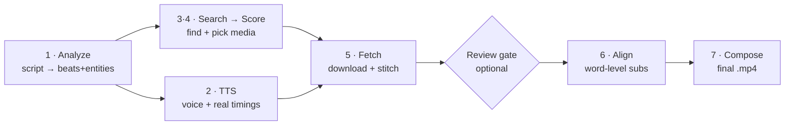

# ScriptReel — How the Pipeline Works (end to end)

A plain-English walkthrough of the whole machine: script in → finished video out. Every stage,
every sub-step, which AI model runs where, and how images vs videos are handled — traced through
one real example the whole way down.

> This is the *explainer*. The formal per-domain specs live in `docs/06` (pipeline), `docs/07`
> (analysis), `docs/08` (search), `docs/09` (matching), `docs/13` (compose), `docs/24`/`docs/25`
> (sourcing). Constants quoted here live in `packages/core/src/constants.ts`.

---

## Two ideas that explain everything

1. **Narration is the clock.** The voiceover is spoken first, its real length is measured, and
   *that* decides how long every visual lasts. Pictures never decide timing — the voice does.
2. **One hand-off file.** The “brain” (analysis + matching) writes a single `timeline.json`. The
   “renderer” (FFmpeg) reads only that. The brain never renders; the renderer never thinks.

---

## The pipeline at a glance

```
analyze → [ search → score  ∥  tts ] → fetch → REVIEW GATE (optional) → align → compose
```

`search→score` and `tts` run **at the same time** (that's why "tts done" can appear before
"search done" in the logs). `fetch` runs *before* the review gate so the storyboard shows the real
stitched clip.



---

## Which model runs, and where

There are exactly **two** backend switches:

- **`LLM_PROVIDER`** — the text/vision brain. `ollama` = your local models; `openai` = the cloud.
  Controls the **analyzer**, **knowledge expansion**, and the **media-fit check**.
- **Apple-Silicon or not** — decided automatically (`is_apple_silicon()` in the Python sidecar).
  Every sidecar model (SigLIP, OCR, identity, the VLM checklist, the generator, TTS, alignment)
  picks its Mac or Windows/Linux backend on its own. You don't set this.

| Model / tool     | Its job                                   | Runs in        | Apple 🍎                | Windows / Linux 🪟              | Cloud ☁️        |
| ---------------- | ----------------------------------------- | -------------- | ----------------------- | ------------------------------- | --------------- |
| **Analyzer LLM** | script → beats, entities, queries         | Stage 1        | —                       | `ollama · qwen2.5-coder:14b`    | `gpt-4o-mini`   |
| **Knowledge LLM**| entity facts (aliases, related, era)      | Stage 3        | —                       | `ollama` (text) *or* Wikidata   | Wikidata API    |
| **Media-fit VLM**| “does this thumbnail match the phrase?”   | Stage 4        | —                       | `ollama · qwen2.5vl / qwen3-vl` | `gpt-4o-mini`   |
| **SigLIP 2**     | image ↔ text similarity                   | Stage 4        | `siglip2` (MPS)         | `siglip2` (CPU / CUDA)          | —               |
| **Tesseract**    | OCR — read watermarks / on-screen text    | Stage 4 gate A | `tesseract`             | `tesseract`                     | —               |
| **InsightFace**  | face identity (right person?)             | Stage 4 gate C | `buffalo_l`             | `buffalo_l`                     | —               |
| **DINOv2**       | landmark / artwork identity               | Stage 4 gate C | `dinov2`                | `dinov2`                        | —               |
| **VLM checklist**| subject / era / framing / text check      | Stage 4 gate D | `mlx-vlm Qwen2.5-VL-3B` | `ollama · qwen2.5vl:3b`         | —               |
| **Generator**    | make an image when nothing is found       | Stage 4 ladder | `FLUX.1-schnell` (mflux)| `SDXL-Turbo` (CUDA)             | —               |
| **Kokoro**       | text → speech (the voiceover)             | Stage 2        | `kokoro`                | `kokoro`                        | —               |
| **Whisper**      | align words to audio for subtitles        | Stage 6        | `mlx-whisper`           | `faster-whisper`                | —               |
| **FFmpeg**       | normalize + assemble the final video      | Stage 5 · 7    | `ffmpeg-full`           | `ffmpeg` (Gyan)                 | —               |

> **So with `LLM_PROVIDER=ollama` on Windows:** analyzer + knowledge + media-fit run on your local
> Ollama models, the VLM checklist runs on `qwen2.5vl:3b` via Ollama, images are matched by SigLIP
> on the GPU, and any generated fallback comes from SDXL-Turbo. **No cloud call at all.**

---

## The example we'll carry through

> **Input script:** *“On July 20th, 1969, Apollo 11 landed on the Moon. Neil Armstrong became the
> first person to walk on another world. Back on Earth, millions held their breath and watched.”*

Three sentences → three **beats**, chosen to show every branch: a **named event** (Apollo 11), a
**named person** (Neil Armstrong), and an **abstract idea** (“millions held their breath”) with no
real subject to find.

---

## Stage 1 · Analyze — the brain reads the script

One LLM call (`ollama qwen2.5-coder:14b` locally, or `gpt-4o-mini` in the cloud) turns prose into
structured beats. Ollama is forced to obey the exact JSON shape with a grammar-constrained schema,
so it can't leave a field out.

**The prompt, in plain English:**

> Split the script into **beats** — one clear visual idea each (usually one sentence). For each:
> - Write a **filmable visual description** in English — what a camera would literally see.
> - Pull out the **named things** (entities): real disambiguated name, its *type* (person, event,
>   planet, landmark, animal, artwork…), its class, a couple of search terms, and whether it can be
>   shown on screen.
> - Plan **2–4 shots**. Each shot names what it *wants*: a person's `portrait`, a country's `flag`
>   or `map`, a place's `scene`/`aerial`, archival `footage`, a `logo`…
> - Tag the **era**: `modern`, `historical`, or `timeless`.
> - Write 3 tiers of **generic** English search queries (`literal` / `conceptual` / `mood`).
>   **Never** put real names in these — names live in the entities and shots.

**What comes out — Beat 1:**

```jsonc
{
  "text": "On July 20th, 1969, Apollo 11 landed on the Moon.",
  "visualDescription": "a spacecraft descending onto a grey, cratered lunar surface",
  "keyPhrase": "Apollo 11 lands",           // short on-screen caption, in script language
  "emotion": "awe",
  "shotType": "wide",
  "era": "historical",                       // pre-modern → prefer archives

  "entities": [
    { "canonical": "Apollo 11", "category": "event", "instanceOf": "space mission",
      "searchTerms": ["Apollo 11 Moon landing"], "visualizable": true },
    { "canonical": "Moon", "category": "astro", "instanceOf": "natural satellite",
      "searchTerms": ["lunar surface"], "visualizable": true }
  ],

  "shots": [
    { "phrase": "lunar module descending",  "entity": "Apollo 11", "want": "footage", "weight": 1.0 },
    { "phrase": "grey cratered moon surface","entity": "Moon",     "want": "scene",   "weight": 0.7 }
  ],

  "queries": {
    "literal": ["spacecraft landing grey surface", "lunar module descent"], // generic, no names
    "conceptual": "space exploration milestone",
    "mood": "vast, historic, silent"
  }
}
```

The split is what makes everything downstream work: the **generic queries** are what stock sites
are good at; the **real names** stay in the entities/shots so archives (NASA, Wikimedia…) can be
asked for the actual thing. Beat 3 (“millions held their breath”) produces **no visualizable
entity** — it's marked abstract and will be served by stock or, worst case, a text card.

---

## Stage 2 · TTS — speak the voice, measure the clock

**Kokoro** (Python sidecar, same on Mac and Windows) synthesizes each beat's narration into a
loudness-normalized audio clip. The crucial output is the **measured length**: Beat 1 might measure
**4.2 s** when spoken → that 4.2 s is locked in as the duration Beat 1's visuals must fill.

Because TTS is independent of finding pictures, the worker runs **TTS and Search→Score in parallel**.

---

## Stage 3 · Search — gather candidates from the right sources

Each beat fans out to the few sources its subject warrants, in four layers.

### 3a · Route by topic + era
The beat is classified into one of ~19 **topics** (space, medicine, history, nature, food,
engineering…) from its text **and** its entity types (`packages/core/src/topics.ts`). Each topic
maps to a prioritized list of specialized archives; if the era is `historical`, archival sources
lead.

```
Beat 1:  topic = space   era = historical
      →  sources = [ internet-archive, library-of-congress, europeana, nasa ]
         (historical archives lead; NASA is space-authoritative)
```

### 3b · Resolve the real thing (authoritative)
Each shot's named entity goes to a source that returns the *actual* subject, matched to the shot's
`want`:
- **Wikidata → Commons** — looks up the entity, verifies it's the right one (checks “instance of”),
  then fetches the exact image for the want (portrait `P18`, flag `P41`, map `P242`…).
- **NASA** — for planets/astro/space, queried by the real name (“Moon”).

Archives are also queried with the beat's **named subject** (`entity.searchTerms[0]`), not the
name-stripped literal — so NASA/Wikimedia are asked for *“Apollo 11”*, not *“spacecraft landing”*.

### 3c · Deepen with knowledge
For each named entity, a quick expansion (Wikidata, or your local LLM when `LLM_PROVIDER=ollama`)
pulls **aliases**, a couple of **related concepts**, and confirms the era. Apollo 11 → related:
**“Saturn V”** → one extra Wikimedia search. That's the associative b-roll that makes a piece feel
*researched* rather than stock.

### 3d · Stock, for texture & fallback
The generic queries hit **Pexels / Pixabay / Openverse** — always available, good for atmosphere
and for abstract beats with no real subject (like Beat 3).

### 3e · Ingest — filter into the pool
Every returned candidate (image or video) runs a gauntlet:

| Filter          | What it does                                                                                    |
| --------------- | ----------------------------------------------------------------------------------------------- |
| **license gate**| Only Public-Domain / CC0 / CC-BY pass. ShareAlike, NonCommercial, NoDerivatives, or *unstated* → dropped (a missing license is a reject, not a maybe). |
| **hygiene**     | Drops too-short videos, too-low resolution, extreme aspect ratios.                              |
| **dedupe**      | Same `provider:id` only once.                                                                   |
| **round-robin** | Interleaves across sources so an archive's best hit is kept before the cap, not buried under stock. |
| **cap 40**      | At most `MAX_CANDIDATES_PER_BEAT = 40` candidates per beat.                                      |

**Images vs videos — the key difference:**
- **Image** → one thumbnail is downloaded; that single frame *is* the candidate, scored directly.
- **Video** → **three** preview frames are pulled (at ~10%, 50%, 90% through the clip) so a video
  is judged on its whole span, not one lucky still.

**Output of Search:** up to 40 rows per beat in the DB, each with its thumbnail(s) on disk, source,
license, dimensions — not yet scored. Beat 1's pool now holds real NASA Apollo imagery,
Internet-Archive footage, Wikimedia photos, a “Saturn V” shot, and generic “spacecraft” stock clips.

---

## Stage 4 · Score — pick the single best per beat

The heart of the machine: embed everything, rank it, verify the top few with local models, choose.

### 4a · Embed & measure similarity (SigLIP 2)
**SigLIP 2** (`google/siglip2-base-patch16-224`) turns text and images into vectors in the same
space, so their **cosine similarity** (−1…1) says how well a picture matches a sentence.
- The beat's `visualDescription` → one text vector.
- Every candidate frame → an image vector (cached on disk).
- **Similarity** = cosine(description, frame). For a **video**, it's the **max over its 3 frames** —
  the best moment wins, and that frame is carried forward.

### 4b · The base score
```
score = 0.62·similarity + 0.14·quality + 0.10·orientation + 0.04·isVideo + 0.05·authority − penalties
```

| Term            | Meaning                                                                                        |
| --------------- | ---------------------------------------------------------------------------------------------- |
| **similarity**  | The dominant term — does the picture show what the beat describes? (SigLIP cosine.)             |
| **quality**     | Resolution fit + duration fit + frame-rate. *(An archive that doesn't report its size is no longer punished.)* |
| **orientation** | Does its shape match the target (landscape / portrait / square)?                                |
| **isVideo**     | A small nudge toward motion in mixed mode.                                                      |
| **authority**   | A source authoritative *for this beat's topic* (NASA on space, Met on art, Wellcome on medicine) gets `AUTHORITY_BONUS = 0.05` — so authentic media beats a prettier stock stand-in. NASA on a *food* beat gets nothing; it's topic-scoped. |
| **penalties**   | Subtracted by the verify gates below, plus reuse / near-duplicate / same-author spacing.        |

### 4c · The verify cascade — cheap checks first, models only on the shortlist
The pool is ranked by score; only the **top few** get the expensive, local-model checks. Each gate
either **vetoes** (removes) or **penalizes** (down-ranks). All three **degrade gracefully** — if a
model isn't installed, that gate is skipped and selection continues.

- **Gate A · OCR (Tesseract, top 5).** Reads text burned into the image. A **watermark**
  (“shutterstock”, “getty”, “©”) → penalty. A near-**full-image text overlay** → veto. On a
  *historical* beat, a burned-in **modern year** → veto (can't be archival).
- **Gate C · Identity (InsightFace / DINOv2, top 5, named subjects only).** Fires only when the beat
  names a specific person/landmark/artwork *and* a reference image exists. **Person →** InsightFace
  compares faces to the entity's Wikidata portrait (`IDENTITY_FACE_TAU = 0.32`); a look-alike is
  vetoed. **Landmark/artwork →** DINOv2 compares the whole image (`IDENTITY_DINO_TAU = 0.55`); a
  wrong one is penalized. For Beat 2 this checks a face really is **Neil Armstrong**.
- **Gate D · VLM checklist (Qwen2.5-VL, top 3).** The final look — `mlx-vlm` on Mac,
  `ollama qwen2.5vl:3b` on Windows — answers a strict yes/no checklist:
  ```
  · is the subject actually present?      no → VETO
  · does the era match?                   no → penalty
  · does the shot framing match?          no → small penalty
  · is there contradicting on-screen text? yes → VETO
  ```
  Adaptively skipped when a beat has no named entity *and* the top match already wins by a clear
  margin — no point burning a model call.

### 4d · Choose — thresholds & the named-subject rule
Beats are walked in order (so the run can avoid reusing an asset or repeating a look):
- Top candidate **≥ τ_hi (0.322)** → chosen, confident.
- Between **τ_lo (0.314)** and τ_hi → chosen but flagged “weak”.
- Below τ_lo → nothing good enough → hand to the fallback ladder.
- **Named-subject rule:** on a beat about a specific person/place, a *confident archive* match (the
  real subject) is preferred even over a higher-scoring generic stand-in — and a *weak* archive
  match is refused rather than faked. The real subject wins, or nothing does.

A final **variety pass**: if one author/source owns >60% of chosen beats, those beats re-pick with
spacing penalties doubled.

### 4e · The fallback ladder — when nothing clears the bar
A beat is never left empty. It climbs rungs until something sticks (each new rung's finds are also
OCR-checked, so escalation can't sneak watermarked stock back in):

| Rung | Source                                                                                    |
| ---- | ----------------------------------------------------------------------------------------- |
| 1    | **Broaden** — re-search a simpler version of the phrase.                                   |
| 2    | **Conceptual** — search the concept tier (“space exploration milestone”).                  |
| 3    | **Mood** — match feeling, not content (“vast, historic, silent”).                          |
| 4    | **Generate** — abstract/non-entity beats only: FLUX (Mac) / SDXL-Turbo (Windows) paints one. Never fabricates a named person or place. |
| 5    | **Text card** — a styled caption. Always succeeds, so a render never dies. Where Beat 3 may land. |

### 4f · Montage — don't hold one shot too long
If a beat's voice runs long (say 6 s), one static shot is boring. The scorer splits it into 2–3
**segments** from diverse candidates whose durations sum to the beat's narration length — a mini-cut
inside one spoken sentence. A last media-fit vision pass drops any segment that clearly shows the
wrong thing.

**Output of Score:** exactly one chosen asset (or an ordered montage) per beat. For Beat 1 that's a
genuine **NASA Apollo 11 photograph** — high similarity plus the space-topic authority bonus,
confirmed by the VLM as “subject present, era historical.” It beat the generic stock clip.

---

## Review gate (optional)

If *“review before render”* is on, the pipeline pauses at the **storyboard**: every beat shown with
its chosen clip and a **source badge** (authoritative sources highlighted). You can swap a pick,
re-search a beat, or pin a text card. Pressing **Continue** resumes with align → compose.

---

## Stage 5 · Fetch — download everything & normalize

Nothing is streamed at render time. For each chosen asset, FFmpeg produces a clean per-beat clip of
exactly the narration length:
- **Video** — cut to length, scaled/cropped to the target frame, 30 fps, uniform pixel format.
- **Image** — given a slow **Ken Burns** pan-and-zoom so a still feels alive.
- **Montage** beats have their 2–3 segments stitched into one clip.

This runs *before* the review gate, so the storyboard shows the real stitched clip.

---

## Stage 6 · Align — word-perfect subtitles

**Whisper** (`mlx-whisper` on Mac, `faster-whisper` on Windows/Linux) does *forced alignment*: it
maps each spoken word to its exact start/end time in the audio. That becomes a styled **ASS subtitle
file** with a karaoke-style highlight sweep, matched to your chosen subtitle preset.

---

## Stage 7 · Compose — assemble the final video

Three FFmpeg passes turn the parts into one `.mp4`. No AI — it just follows the timeline.

| Pass | What it does                                                                                    |
| ---- | ----------------------------------------------------------------------------------------------- |
| A    | **Normalize** — every beat clip forced to identical geometry / fps / pixel format (mostly done in Fetch). |
| B    | **Assemble** — concatenate the beat clips and cross-fade (`xfade`) between them into one video. |
| C    | **Finish** — burn in subtitles, mix the voiceover with background music (music auto-ducks under the voice), encode the final H.264 file. |

The encoder is picked for your machine — VideoToolbox on Mac; on Windows it probes the GPU (NVENC)
once and quietly falls back to CPU (libx264) if the driver's too old, so a render always completes.

---

## Beat 1, end to end

| Stage    | What happens to “Apollo 11 landed on the Moon”                                                    |
| -------- | ------------------------------------------------------------------------------------------------- |
| Analyze  | Beat with visualDescription “spacecraft descending onto grey lunar surface”, entities **Apollo 11** (event) + **Moon** (astro), era **historical**, 2 shots, generic queries. |
| TTS      | Kokoro speaks it → measured **4.2 s**. That's now the beat's visual duration.                     |
| Search   | topic **space** + historical → NASA/IA/LoC/Europeana/Wikimedia queried for **“Apollo 11”**; Moon shot → NASA(“Moon”) + Wikidata→Commons; related **“Saturn V”** → Wikimedia; stock “spacecraft” clips too. Filtered to a 40-candidate pool. |
| Score    | SigLIP ranks them. A NASA Apollo photo scores high on similarity, **+0.05 space authority**, passes OCR (no watermark, no modern date), and the VLM confirms “subject present, era historical.” **Chosen over the stock clip.** |
| Fetch    | The NASA image is downloaded and given a 4.2 s Ken Burns push across the lunar surface.           |
| Align    | Whisper time-stamps the words; the “Apollo 11 lands” caption sweeps in sync.                      |
| Compose  | Cross-faded into Beat 2 (Neil Armstrong), subtitles burned, music ducked, encoded. **Done.**      |

That's the whole point of the redesign: Beat 1 lands on a **real NASA photograph of the actual
mission** instead of a generic stock “spacecraft” — the difference between a stock slideshow and a
researched documentary.

---

## Env quick-reference

| Variable                    | What it controls                                                        |
| --------------------------- | ----------------------------------------------------------------------- |
| `LLM_PROVIDER`              | `ollama` (local) or `openai` (cloud) — analyzer, knowledge, media-fit.  |
| `OLLAMA_MODEL`              | Local text model (analyze + knowledge). Use a *non-reasoning* coder model. |
| `OLLAMA_VISION_MODEL`       | Local vision model for media-fit.                                       |
| `VLM_REMOTE_MODEL`          | Local model for the score-stage VLM checklist gate (Windows).          |
| `VIDEO_ENCODER`             | `h264_nvenc` (NVIDIA GPU), else auto (VideoToolbox on Mac, libx264 elsewhere). |
| `FASTER_WHISPER_DEVICE`     | `cuda` for GPU subtitle alignment on Windows.                          |
| Provider API keys           | Added in-app → **Settings → API Keys** (stored in the DB), not in `.env`. |

Sidecar models (SigLIP, Tesseract, InsightFace, DINOv2, VLM, generator, Kokoro, Whisper) pick their
Apple vs Windows/Linux backend automatically — you don't configure that.
